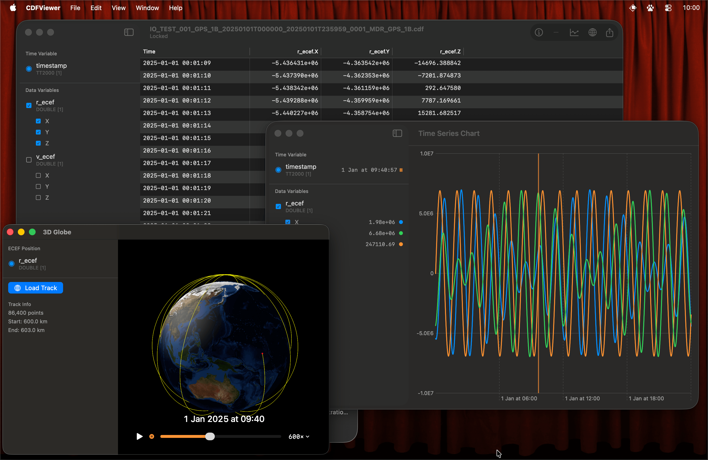

<p align="center">
  
</p>

# CDF Viewer

A native macOS app for viewing NASA CDF (Common Data Format) files. Built with Swift and SwiftUI.



## Features

- **Data Table** - Browse all 86,400+ records with smooth scrolling (NSTableView-based virtualization)
- **Time Series Charts** - Plot any numeric variable with min-max decimation to preserve peaks
- **3D Globe** - Visualize ECEF satellite positions on a Blue Marble Earth texture
- **Synchronized Cursor** - Hover/click on any view to highlight the same timestamp across all views
- **Native CDF Parser** - Pure Swift implementation, no external dependencies

## Requirements

- macOS 14.0 (Sonoma) or later

## Installation

Download the latest release from the [Releases](https://github.com/iota-technology/cdf-viewer/releases) page.

## Building from Source

```bash
cd CDFViewer
xcodebuild -scheme CDFViewer -configuration Release build
open ~/Library/Developer/Xcode/DerivedData/CDFViewer-*/Build/Products/Release/CDFViewer.app
```

## Supported CDF Features

- CDF version 3.x files (single-file format)
- GZIP-compressed variable records (CVVR) with multi-level VXR index trees
- All standard data types: INT1/2/4/8, UINT1/2/4, FLOAT, DOUBLE, EPOCH, EPOCH16, TT2000, CHAR
- Row-major and column-major formats
- zVariables and rVariables with multi-dimensional arrays
- ISTP metadata conventions (DEPEND_0/1/2, LABL_PTR_*, VAR_TYPE, DISPLAY_TYPE)

## License

MIT
